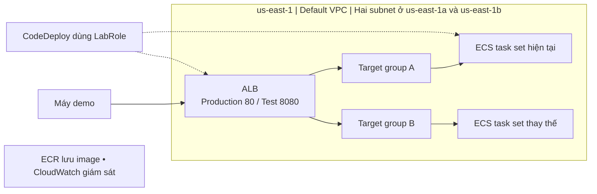

# Sơ đồ kiến trúc blue/green dự kiến trên ECS

```mermaid
flowchart LR
    Demo["Máy demo"]
    CodeDeploy["CodeDeploy dùng LabRole"]
    Services["ECR lưu image • CloudWatch giám sát"]

    subgraph Network["us-east-1 | Default VPC | Hai subnet ở us-east-1a và us-east-1b"]
        ALB["ALB<br/>Production 80 / Test 8080"]
        TargetA["Target group A"]
        TargetB["Target group B"]
        Current["ECS task set hiện tại"]
        Replacement["ECS task set thay thế"]

        ALB --> TargetA
        ALB --> TargetB
        TargetA --> Current
        TargetB --> Replacement
    end

    Demo --> ALB
    CodeDeploy -.-> ALB
    CodeDeploy -.-> Current
```
